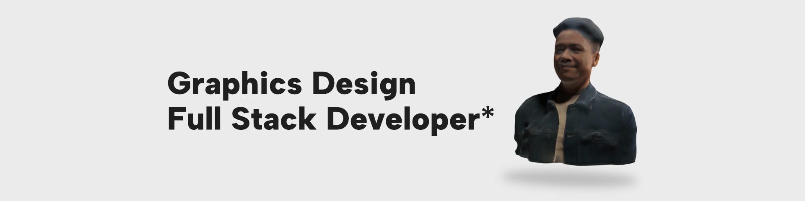
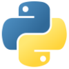

# Welcome!

---

---

## Hi, I’m Collins. 🫡

Thanks for visiting my GitHub page. I am an aspiring graphics designer and full-stack developer (hence the asterisk). I have always been interested in coding, so at the beginning of 2024, I started my coding journey. I mostly dabble in the front end but am getting to know the back end day after day.  I enjoy using HTML, CSS and JavaScript. I’m currently learning React and Python, then eventually to move on to three.js and C++ (for unreal).  Please take a look at some of my projects, but please be nice, I'm still only a beginner.

---

### Languages

<code></code>
<code></code>
<code></code>
<code></code>

---

### Currently

- Following a Data Structures and Algorithms in Python course on Udemy.
- Learning React.
- Looking for a job in tech.

---

### Socials 

[LinkedIn](https://www.linkedin.com/in/collinscomondi/)  
[Instagram](https://www.instagram.com/someprofoundname/)  
[Website_Portfolio](https://www.someprofoundname.com)